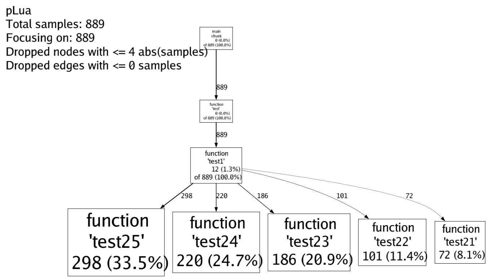
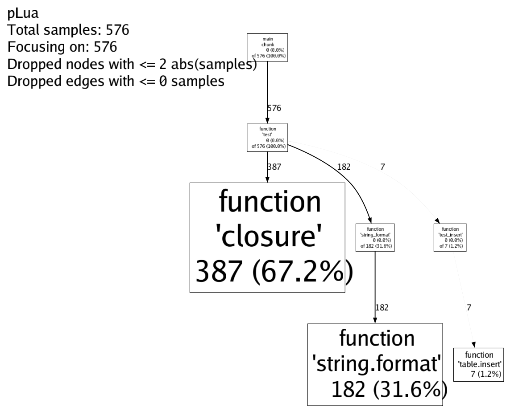
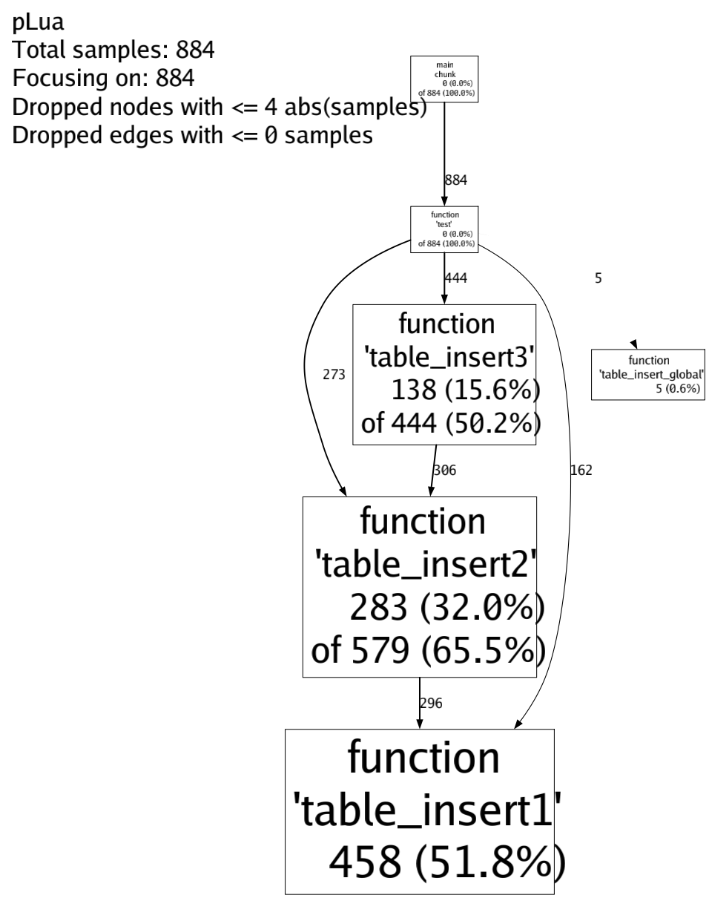
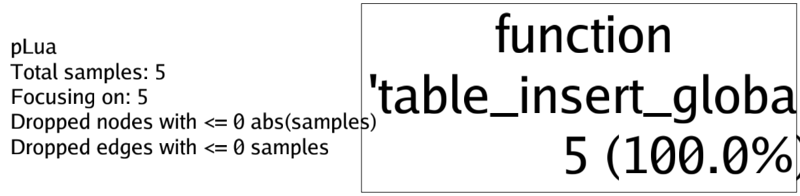

# pLua

[](https://github.com/esrrhs/pLua)
[](https://github.com/esrrhs/pLua)
[](https://github.com/esrrhs/pLua/actions)

Lua 性能分析工具

## 简介
类似于gperftools，可分析Lua程序的热点及内存分配情况


## 特性
- 简单，只需几行代码，即可输出结果，或通过[hookso](https://github.com/esrrhs/hookso)注入，不用修改代码
- 准确，相比lua hook，定时采样的方式更能准确捕获lua执行的热点，使用ITIMER_PROF剔除sleep等堆栈
- 轻量，因为是采样的，相比直接按行lua hook，能最小程度影响宿主程序的运行
- 直观，输出调用图，能直观的看到热点和调用关系，可兼容[gperftools](https://github.com/gperftools/gperftools)的pprof工具，可生成[火焰图](https://github.com/brendangregg/FlameGraph)

## 编译
* 安装lua
* 编译插件libplua.so及tools
```shell
# ./build.sh
```
* 安装火焰图的依赖项
```shell
# yum install perl-open.noarch
```

## 使用
#### 获取CPU采样数据
* 修改Lua code
``` lua
-- 引入libplua.so
local p = require "libplua"
-- 开启采样
-- 参数1：采样时间（秒），0表示一直采样
-- 参数2：采样结果文件
p.start(0, "call.pro")

do_some_thing()

-- 结束采样，输出结果文件
p.stop()

```
* 或者用[hookso](https://github.com/esrrhs/hookso)注入
```shell
a) 首先获取进程中的Lua_State指针，比如进程的xxx.so调用了lua_settop(L)函数，那么就取第一个参数
# ./hookso arg $PID xxx.so lua_settop 1 
123456

b) 加载libplua.so
# ./hookso dlopen $PID ./libplua.so

c) 执行libplua.so的lrealstart手动开启，等价于lrealstart(L, 0, "./call.pro")
# ./hookso call $PID libplua.so lrealstart i=123456 i=0 s="./call.pro"

c) 执行libclua.so的lrealstop手动关闭，等价于lrealstop(L)
# ./hookso call $PID libplua.so lrealstop i=123456
```
#### 获取内存采样数据
* 修改Lua code
``` lua
-- 引入libplua.so
local p = require "libplua"
-- 开启采样
-- 参数1：采样时间（秒），0表示一直采样
-- 参数2：采样结果文件名，会生成三个采样文件，分别代表内存分配大小、内存分配次数、内存占用大小
p.start_mem(0, "mem.pro")

do_some_thing()

-- 结束采样，输出结果文件
p.stop_mem()

```
* 或者用[hookso](https://github.com/esrrhs/hookso)注入
```shell
a) 首先获取进程中的Lua_State指针，比如进程的xxx.so调用了lua_settop(L)函数，那么就取第一个参数
# ./hookso arg $PID xxx.so lua_settop 1 
123456

b) 加载libplua.so
# ./hookso dlopen $PID ./libplua.so

c) 执行libplua.so的lrealstartmem手动开启，等价于lrealstartmem(L, 0, "./call.pro")
# ./hookso call $PID libplua.so lrealstartmem i=123456 i=0 s="./call.pro"

c) 执行libclua.so的lrealstopmem手动关闭，等价于lrealstopmem(L)
# ./hookso call $PID libplua.so lrealstopmem i=123456
```

## 示例
#### 运行test目录下的lua
```shell
# lua test_cpu.lua
# lua test_mem.lua
```

#### 生成可视化结果
使用tools目录下的show.sh脚本生成gperftools风格png及火焰图
```shell
# cd tools
# ./show.sh ../test
```

#### 查看test_cpu.lua的热点


#### 查看test_mem.lua的内存采样
* 内存分配次数

* 内存分配大小

* 内存占用大小


## 其他
[lua全家桶](https://github.com/esrrhs/lua-family-bucket)
