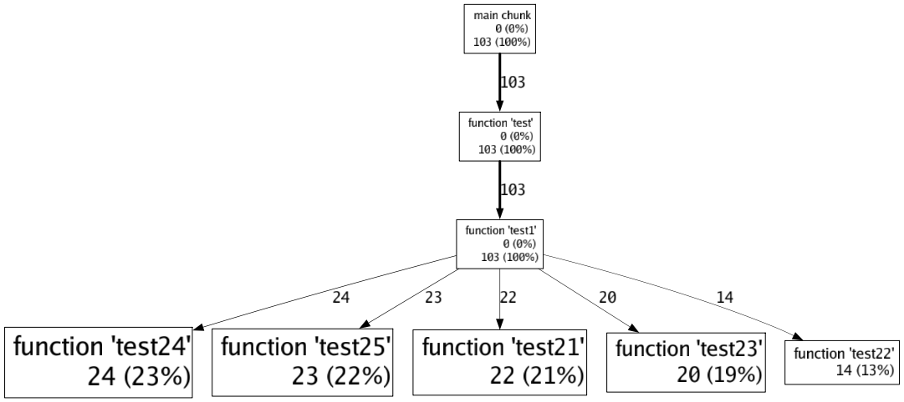
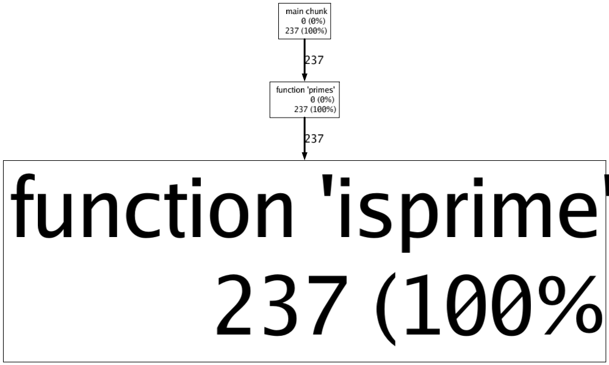

# pLua

[](https://github.com/esrrhs/pLua)
[](https://github.com/esrrhs/pLua)
[](https://github.com/esrrhs/pLua/actions)

Lua 性能分析工具

## 原理
类似于gperftools，通过定时器信号回调查看调用栈，来定位调用的热点

## 特性
- 简单，只需几行代码，即可输出结果，或通过[hookso](https://github.com/esrrhs/hookso)注入，不用修改代码
- 准确，相比lua hook，定时采样的方式更能准确捕获lua执行的热点
- 轻量，因为是采样的，相比直接按行lua hook，能最小程度影响宿主程序的运行
- 直观，输出调用图，能直观的看到热点和调用关系

## 编译
* 安装lua 5.3
* 编译插件libplua.so
``` bash
# ./build.sh
```
* 编译解析器plua
``` bash
# go get github.com/goccy/go-graphviz
# go build plua.go
```

## 使用
#### 获取采样数据
* 修改Lua code
``` lua
-- 引入libplua.so
local p = require "libplua"
-- 开启采样
-- 参数1：采样时间（秒），0表示一直采样
-- 参数2：采样结果文件
p.start(0, "call.pro")

do_some_thing()

-- 结束采样，输出结果文件
p.stop()

```
* 或者用[hookso](https://github.com/esrrhs/hookso)注入
```
a) 首先获取进程中的Lua_State指针，比如进程调用了lua_settop(L)函数，那么就取第一个参数
# ./hookso arg $PID lua_settop 1 
123456

b) 加载libplua.so
# ./hookso dlopen $PID ./libplua.so

c) 执行libplua.so的lrealstart手动开启，等价于lrealstart(L, 0, "./call.pro")
# ./hookso call $PID libplua.so lrealstart i=123456 i=0 s="./call.pro"

c) 执行libclua.so的lrealstop手动关闭，等价于lrealstop(L)
# ./hookso call $PID libplua.so lrealstop i=123456
```
#### 生成采样结果
* 查看生成的call.pro
```
# 转成txt格式
# ./plua -i call.pro -text

# 转成dot格式
# ./plua -i call.pro -dot

# 转成svg格式
# ./plua -i call.pro -png output.svg

# 转成png格式
# ./plua -i call.pro -png output.png
```

## 示例
* 运行lua
```bash
# lua test1.lua
# lua test2.lua
```
* 生成png
```bash
# ./plua -i call.pro -png test1.png
# ./plua -i prime.pro -png test2.png
```

* 查看test1.png


* 查看test2.png



## 其他
[lua全家桶](https://github.com/esrrhs/lua-family-bucket)
